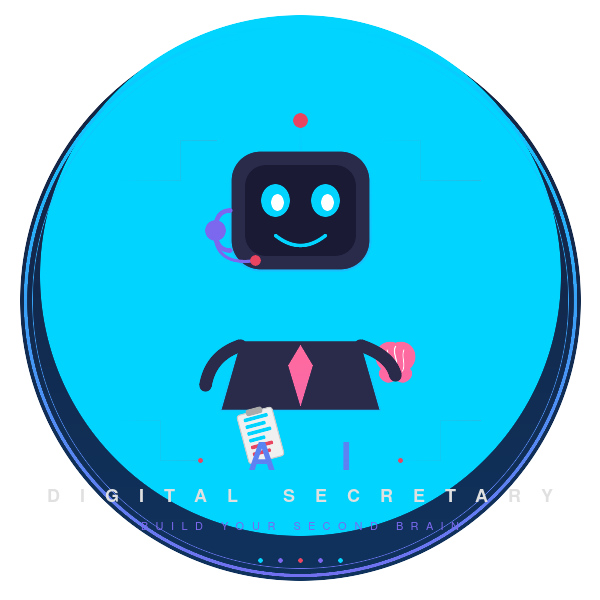
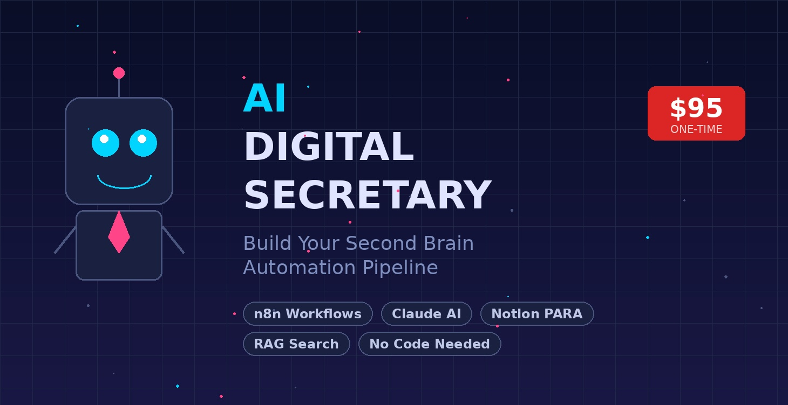

  

<h1 align="center">AI Digital Secretary</h1>

<h3 align="center">Build Your Second Brain &mdash; Automate Notes, Highlights &amp; Action Items</h3>

  
  
  

---

## The Problem

You read books, highlight passages, take notes, attend meetings... and then forget 90% of it. Your knowledge is scattered across Kindle, PDFs, notebooks, and apps. Sound familiar?

## The Solution

**AI Digital Secretary** is a step-by-step course that builds an automated pipeline to capture, organize, and retrieve everything you read and learn. No coding required.

Using **n8n** (free, self-hosted), **Claude AI**, and **Notion**, you'll build a system that:

- Captures Kindle highlights and PDF notes automatically via email
- Extracts and classifies action items using AI
- Organizes everything into a searchable Notion "Second Brain"
- Lets you have conversations with your own notes using RAG

  

---

## What's Included

| Module | Title | What You'll Build |
|--------|-------|-------------------|
| 1 | **Welcome & Setup Your Foundation** | Kindle Fire setup, n8n install, API keys |
| 2 | **Build Your Notion Second Brain** | Complete Notion database with smart properties |
| 3 | **Set Up Your Email-to-Drive Pipeline** | Automated email capture workflow |
| 4 | **Build the AI Processing Pipeline** | 16-node n8n workflow with Claude AI |
| 5 | **Talk to Your Notes (AI RAG Setup)** | Retrieval-Augmented Generation for your notes |
| 6 | **Customize, Maintain & Level Up** | Troubleshooting, optimization, advanced tips |

Each module includes labeled **[DO THIS]**, **[CONTEXT]**, and **[GOOD TO KNOW]** sections so you always know what to do, why it matters, and helpful extras.

---

## Workflow Templates

These are the n8n workflow JSON files used in the course. **Import them directly into your n8n instance.**

> **Note:** These templates require configuration with your own API keys and folder IDs. Full setup instructions are provided in the course.

| Template | Module | Description |
|----------|--------|-------------|
| [`kindle_email_to_drive_TEMPLATE.json`](workflows/kindle_email_to_drive_TEMPLATE.json) | Module 3 | Email-to-Google Drive capture workflow |
| [`kindle_pipeline_processing_TEMPLATE.json`](workflows/kindle_pipeline_processing_TEMPLATE.json) | Module 4 | 16-node AI processing pipeline with Claude |

### How to Import

1. Open your n8n instance
2. Click **"Add workflow"** in the top right
3. Select **"Import from file"**
4. Choose the downloaded `.json` file
5. Follow the course instructions to configure your credentials

---

## Tech Stack

| Tool | Purpose | Cost |
|------|---------|------|
| **n8n** | Workflow automation | Free (self-hosted) |
| **Claude AI** | Text extraction & classification | Pay-per-use API |
| **Notion** | Second Brain database | Free tier works |
| **Google Drive** | File staging & storage | Free tier works |
| **Kindle** | Reading & highlighting | $59 Fire tablet or $400 - $500 Kindle Scribe (reccomemnded)|

---

## Who This Is For

- Avid readers who want to retain more from what they read
- Knowledge workers drowning in notes, highlights, and action items
- Anyone curious about AI automation without needing to code
- People who want a "Second Brain" but don't know where to start

---

  

  <strong>$95 one-time</strong> &mdash; lifetime access to all 6 modules, workflow templates, and PDF guides

  Built with Claude AI, n8n, and Notion &bull; Part of the <a href="https://www.skool.com/dotcomcrowd-4789">DotComCrowd</a> community

